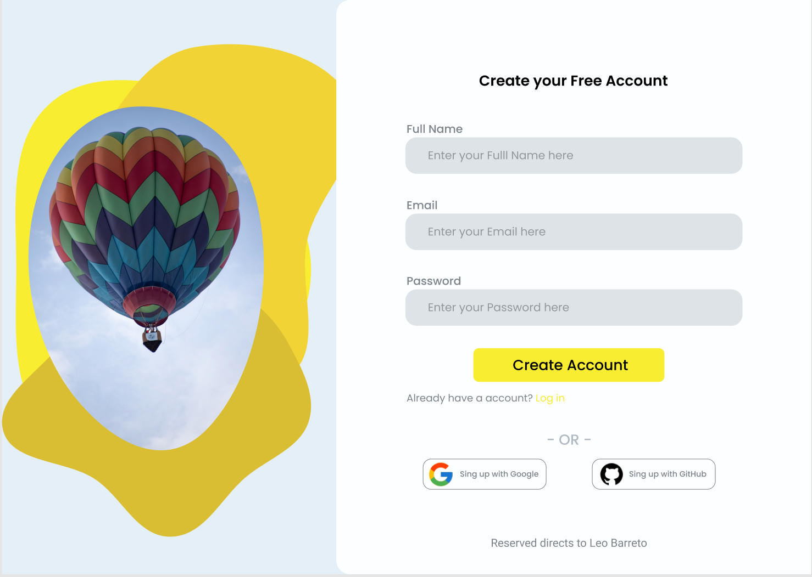

# Figma MCP Use Case: Login UI Concept Implementation

This project demonstrates how to convert a Figma design into frontend code using the [Figma‑Context‑MCP](https://github.com/GLips/Figma-Context-MCP). The output is implemented in HTML and styled with Tailwind CSS, but the same process can be adapted to generate code for other platforms such as iOS or Android.

## Implementation Process Article

For a step-by-step walkthrough of how this was done using Figma MCP, check out the full guide:

**[Instantly Convert Figma to Code Using Figma MCP: A Complete Usecase](https://heymcp.io/articles/instantly-convert-figma-to-code-using-figma-mcp-a-complete-usecase/jsonx)**

## Project Structure

- **index.html** - Main implementation of the Figma design
- **responsive.html** - Responsive version with mobile-friendly layout
- **images/** - SVG assets exported from the original Figma file

## Features

- Accurate translation of Figma layout and styles into code
- Uses Tailwind CSS (via CDN) for rapid styling
- Responsive design with media queries and mobile-first structure
- Clean HTML structure, easy to extend or integrate
- Custom color palette and SVG shapes as in the original Figma

## Usage

Simply open either HTML file in a web browser to view the implementation. No build steps or installation required.

## Figma design

Original Figma design: [Login UI Concept (Community)](https://www.figma.com/community/file/1026170425902325131/loginuiconcep)
